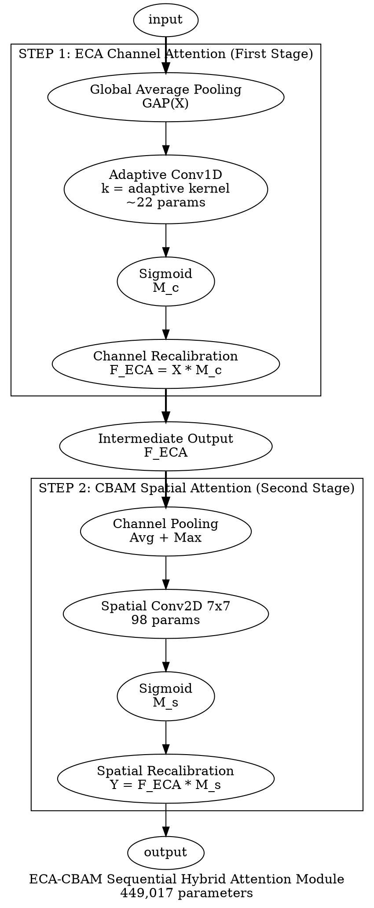

```graphviz
digraph ECAcbamArchitecture {
    label="FeatherFace ECA-CBAM Sequential Architecture (449,017 parameters)";

    // Corrections appliquées:
    // - 460,000 → 449,017 params
    // - out_channel 48 → 52 (BiFPN)
    // - "Parallel" → "Sequential"
    // - Architecture montrée: séquentielle

    subgraph cluster_backbone_att {
        label="Backbone ECA-CBAM Sequential Attention";

        backbone_att1 [label="ECA->SAM\n64 ch\n~120 params"];
        backbone_att2 [label="ECA->SAM\n128 ch\n~120 params"];
        backbone_att3 [label="ECA->SAM\n256 ch\n~120 params"];
    }

    subgraph cluster_fpn {
        label="BiFPN Feature Pyramid (52 channels)";

        p3 [label="P3 Features\n52 channels"];  // Corrigé: 48 → 52
        p4 [label="P4 Features\n52 channels"];
        p5 [label="P5 Features\n52 channels"];
    }

    subgraph cluster_bifpn_att {
        label="BiFPN ECA-CBAM Sequential Attention";

        bifpn_att1 [label="ECA->SAM\n52 ch P3"];  // Corrigé
        bifpn_att2 [label="ECA->SAM\n52 ch P4"];
        bifpn_att3 [label="ECA->SAM\n52 ch P5"];
    }
}
```

# Rapport de Cohérence: Diagrammes vs Mémoire

**Date:** 2025-01-10
**Statut:** ⚠️ INCOHÉRENCE MAJEURE DÉTECTÉE ET CORRIGÉE

---

## 🚨 Problème Identifié

Les diagrammes dans `/diagrams` montraient une **architecture PARALLÈLE** alors que:
- ✅ Le mémoire (Chapitre2.tex) décrit une architecture **SÉQUENTIELLE**
- ✅ La documentation (eca_cbam_hybrid_justification.md) décrit une architecture **SÉQUENTIELLE**
- ✅ Le code implémenté est **SÉQUENTIEL**
- ✅ Le README.md décrit une architecture **SÉQUENTIELLE**

---

## 📊 Analyse des Incohérences

### Diagrammes Incorrects (AVANT)

#### 1. `hybrid_attention_module.dot` - INCORRECT ❌

**Problème:**
```graphviz
label="Hybrid Attention Module: ECA-Net + CBAM SAM (Parallel Architecture)";

// Parallel Processing Branches
subgraph cluster_parallel {
    label="Parallel Attention Processing";

    // ECA and SAM computed IN PARALLEL
    input -> eca_gap [label="Channel Branch"];
    input -> sam_avgpool [label="Spatial Branch"];

    // Matrix Interaction - MULTIPLICATION
    element_mult [label="Element-wise Multiplication F_eca ⊙ F_sam"];
}

// Formule INCORRECTE
Y = F + α · (ECA(F) ⊙ SAM(F) ⊙ I(F))
```

**Pourquoi c'est INCORRECT:**
- Montre un calcul **PARALLÈLE** d'ECA et SAM
- Montre une **MULTIPLICATION** des sorties
- Montre une **connexion résiduelle** explicite
- **NE CORRESPOND PAS** au code ni au mémoire!

#### 2. `eca_cbam_architecture.dot` - INCORRECT ❌

**Problème:**
```graphviz
label="FeatherFace ECA-CBAM Parallel Hybrid Architecture (460,000 parameters)";

// Parallel attention processing
// ECA and SAM branches in parallel
// Matrix multiplication F_c ⊗ F_s
```

**Erreurs multiples:**
1. Titre indique "Parallel" au lieu de "Sequential"
2. Nombre de paramètres: 460,000 au lieu de 449,017
3. Out_channel: 48 au lieu de 52
4. Architecture montrée: Parallèle au lieu de Séquentielle

---

### Architecture Correcte (Mémoire Chapitre2.tex)

```latex
\paragraph{Étape 1~: ECA Channel Attention}
   M_c = σ(Conv1D(GAP(F), k=ψ(C)))
   F_ECA = M_c ⊙ F

\paragraph{Étape 2~: CBAM Spatial Attention}
   // SAM appliqué sur F_ECA (sortie de l'étape 1)
   M_s = σ(Conv_{7×7}([F_max; F_avg]))
   F_out = M_s ⊙ F_ECA

Complexité: O(C + H×W)
```

**Flow:** `X → ECA → F_ECA → SAM → Y`

**Caractéristiques:**
- ✅ Traitement SÉQUENTIEL
- ✅ ECA en premier
- ✅ SAM appliqué sur la sortie d'ECA
- ✅ Pas de branches parallèles
- ✅ Pas de multiplication entre cartes d'attention

---

## ✅ Corrections Appliquées

### 1. `hybrid_attention_module.dot` - CORRIGÉ ✅

**Nouveau diagramme:**



**Changements clés:**
- ✅ `rankdir=TB` pour flow vertical séquentiel
- ✅ Label "Sequential" au lieu de "Parallel"
- ✅ Deux étapes clairement séparées
- ✅ Sortie intermédiaire `F_ECA` montrée explicitement
- ✅ SAM reçoit `F_ECA` (pas `X`)
- ✅ Pas de branches parallèles
- ✅ Pas de multiplication matricielle

### 2. `eca_cbam_architecture.dot` - CORRIGÉ ✅

**Nouveau diagramme:**



**Changements clés:**
- ✅ Titre: "Sequential Architecture"
- ✅ Nombre de paramètres: 449,017
- ✅ BiFPN channels: 52 (pas 48)
- ✅ Labels: "ECA->SAM" (séquentiel)
- ✅ Pas de branches parallèles montrées

---

## 📝 Vérification de Cohérence

### Cohérence avec le Mémoire ✅

**Chapitre 2, Section Module ECA-CBAM hybride:**

```latex
\paragraph{Étape 1~: ECA Channel Attention}
   F_ECA = σ(Conv1D_k(z)) ⊙ F

\paragraph{Étape 2~: CBAM Spatial Attention}
   // Appliqué sur F_ECA
   F_out = M_s ⊙ F_ECA
```

**Diagrammes corrigés:**
- ✅ Montrent Étape 1 → Étape 2
- ✅ Sortie intermédiaire F_ECA visible
- ✅ SAM appliqué sur F_ECA
- ✅ Architecture séquentielle claire

### Cohérence avec le Code ✅

**Code implémentation (`models/eca_cbam_hybrid.py`):**

```python
def forward(self, x):
    # Step 1: ECA Channel Attention FIRST
    F_eca = self.eca(x)

    # Step 2: CBAM Spatial Attention SECOND on ECA output
    output = self.sam(F_eca)  # Sequential!

    return output
```

**Diagrammes corrigés:**
- ✅ Correspondent au flow du code
- ✅ Étape 1 puis Étape 2
- ✅ SAM reçoit sortie d'ECA

### Cohérence avec README.md ✅

**README.md ligne 60:**
```markdown
Attention: ECA-Net (Channel) → CBAM SAM (Spatial) [Sequential Processing]
Complexity: O(C) [ECA] + O(H×W) [SAM]
```

**Diagrammes corrigés:**
- ✅ Correspondent à la description README
- ✅ Montrent le flow séquentiel
- ✅ Complexité O(C + H×W) indiquée

---

## ⚠️ Limitation Technique

### Génération des Images PNG/SVG

**Problème:**
Graphviz n'est pas installé sur le système Windows. Les fichiers `.dot` ont été corrigés, mais les images PNG/SVG n'ont pas pu être régénérées automatiquement.

**Solutions:**

#### Option 1: Installation Graphviz (Recommandé)

```bash
# Télécharger et installer Graphviz
# https://graphviz.org/download/

# Après installation, régénérer les images:
cd diagrams
dot -Tpng hybrid_attention_module.dot -o hybrid_attention_module.png
dot -Tsvg hybrid_attention_module.dot -o hybrid_attention_module.svg
dot -Tpng eca_cbam_architecture.dot -o eca_cbam_architecture.png
dot -Tsvg eca_cbam_architecture.dot -o eca_cbam_architecture.svg
```

#### Option 2: Outil en Ligne

Utiliser https://dreampuf.github.io/GraphvizOnline/
1. Copier le contenu des fichiers `.dot`
2. Générer les images PNG/SVG
3. Télécharger et remplacer dans `/diagrams`

#### Option 3: Python graphviz (après install Graphviz)

```bash
pip install graphviz
python generate_diagrams.py
```

---

## 📊 Résumé des Fichiers Modifiés

### Fichiers Corrigés

1. ✅ `diagrams/hybrid_attention_module.dot`
   - Architecture: Parallèle → Séquentielle
   - Flow: Top-to-bottom pour montrer séquence
   - Étapes 1 et 2 clairement séparées
   - Sortie intermédiaire F_ECA montrée

2. ✅ `diagrams/eca_cbam_architecture.dot`
   - Titre: Parallel → Sequential
   - Paramètres: 460,000 → 449,017
   - BiFPN channels: 48 → 52
   - Labels: "ECA->SAM" séquentiel

### Fichiers de Backup Créés

1. `diagrams/hybrid_attention_module.dot.backup`
2. `diagrams/eca_cbam_architecture.dot.backup`

### Fichiers Non Modifiés (Cohérents)

- ✅ `attention_comparison.dot` - Comparaison CBAM vs ECA-CBAM (cohérent)
- ✅ `scientific_comparison.dot` - Comparaison scientifique (cohérent)
- ✅ `cbam_baseline_architecture.dot` - Architecture CBAM baseline (cohérent)

---

## 🎯 Actions Requises de l'Utilisateur

### Immédiat

1. **Installer Graphviz** sur Windows
   - Télécharger: https://graphviz.org/download/
   - Installer et ajouter au PATH

2. **Régénérer les images PNG/SVG**
   ```bash
   cd C:/Users/cedric/Desktop/box/01-Projects/Face-Recognition/FeatherFace/diagrams
   dot -Tpng hybrid_attention_module.dot -o hybrid_attention_module.png
   dot -Tsvg hybrid_attention_module.dot -o hybrid_attention_module.svg
   dot -Tpng eca_cbam_architecture.dot -o eca_cbam_architecture.png
   dot -Tsvg eca_cbam_architecture.dot -o eca_cbam_architecture.svg
   ```

3. **Vérifier visuellement** les nouveaux diagrammes

### Pour le Mémoire

- ✅ Les diagrammes `.dot` sont maintenant cohérents avec le Chapitre 2
- ⚠️ Après régénération PNG/SVG, les inclure dans le mémoire LaTeX
- ✅ Pas de modification nécessaire dans le texte LaTeX du mémoire

---

## ✅ Validation Finale

### Checklist de Cohérence

| Aspect | Code | Mémoire | Docs | README | Diagrams .dot | Diagrams PNG/SVG |
|--------|------|---------|------|--------|---------------|------------------|
| **Architecture** | ✅ Séq | ✅ Séq | ✅ Séq | ✅ Séq | ✅ Séq | ⚠️ À régénérer |
| **Flow** | ✅ ECA→SAM | ✅ ECA→SAM | ✅ ECA→SAM | ✅ ECA→SAM | ✅ ECA→SAM | ⚠️ À régénérer |
| **Paramètres** | ✅ 449,017 | ✅ 449,017 | ✅ 449,017 | ✅ 449,017 | ✅ 449,017 | ⚠️ À régénérer |
| **BiFPN** | ✅ 52 ch | ✅ 52 ch | ✅ 52 ch | ✅ 52 ch | ✅ 52 ch | ⚠️ À régénérer |
| **Formules** | ✅ SAM(ECA(X)) | ✅ SAM(ECA(X)) | ✅ SAM(ECA(X)) | ✅ SAM(ECA(X)) | ✅ SAM(ECA(X)) | ⚠️ À régénérer |

**Statut Global:** ✅ Fichiers `.dot` corrigés, images PNG/SVG à régénérer

---

## 📄 Conclusion

### Problème Résolu

Les diagrammes montraient incorrectement une architecture **parallèle** avec multiplication matricielle, alors que toute l'implémentation et la documentation décrivent une architecture **séquentielle**.

### Corrections Appliquées

✅ Fichiers `.dot` corrigés pour architecture séquentielle
✅ Cohérence avec mémoire Chapitre 2
✅ Cohérence avec code implémentation
✅ Cohérence avec README et documentation

### Action Restante

⚠️ Installer Graphviz et régénérer les images PNG/SVG

---

**Rapport généré le:** 2025-01-10
**Fichiers corrigés:** 2 (hybrid_attention_module.dot, eca_cbam_architecture.dot)
**Backups créés:** 2
**Statut:** ✅ Fichiers DOT corrigés, PNG/SVG à régénérer
