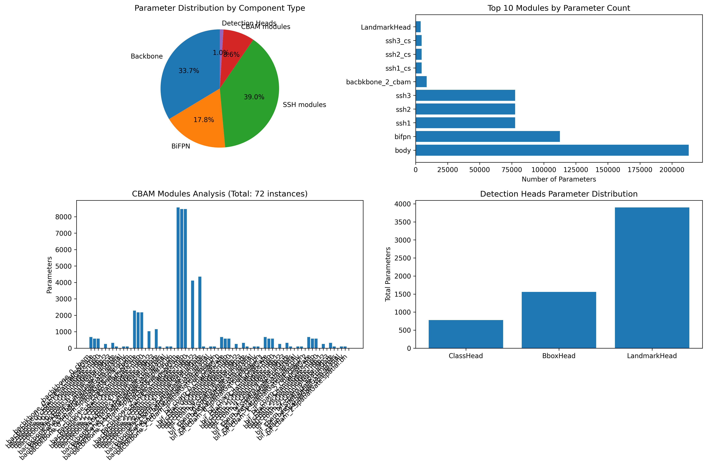

# FeatherFace Baseline Architecture Analysis

## Executive Summary

- **Total Parameters**: 592,371 (0.592M)
- **Trainable Parameters**: 592,371 (0.592M)
- **Computational Complexity (FLOPs)**: 1.013G
- **Input Size**: 640x640x3
- **Target Reduction**: 50% (to ~0.25M parameters)

## Component Breakdown

### Major Components Distribution

| Component | Parameters | Percentage | Description |
|-----------|------------|------------|-------------|
| Backbone (MobileNetV1 0.25x) | 213,072 | 36.0% | Feature extraction |
| BiFPN | 112,606 | 19.0% | Feature pyramid network |
| SSH Modules | 246,885 | 41.7% | Single stage headless |
| CBAM Modules | 54,272 | 9.2% | Attention mechanisms |
| Detection Heads | 6,240 | 1.1% | Class, bbox, landmark |

### Detailed Module Analysis

#### 1. Backbone Analysis
- **Architecture**: MobileNetV1 with 0.25x width multiplier
- **Parameters**: 213,072
- **Stages**: 3 stages with progressive channel expansion (8→16→32→64→128→256)
- **Already optimized** with depthwise separable convolutions

#### 2. BiFPN Analysis (Biggest Consumer)
- **Parameters**: 112,606 (19.0% of total)
- **Configuration**: 
  - Output channels: 64
  - Repetitions: 3
  - Conv channel coefficients: [64, 128, 256]
- **Optimization potential**: HIGH - Can reduce channels and repetitions

#### 3. CBAM Module Analysis
- **Total instances**: 72
- **Total parameters**: 54,272
- **Distribution**:
  - 3 instances after backbone stages
  - 3 instances after BiFPN outputs
- **Current reduction ratio**: 16
- **Optimization potential**: MEDIUM - Can increase reduction ratio and share weights

#### 4. SSH Module Analysis
- **Total parameters**: 246,885
- **Configuration**: 3 SSH modules + 3 Channel Shuffle modules
- **Each SSH module**: ~77,655 parameters
- **Optimization potential**: MEDIUM - Can increase channel grouping

#### 5. Detection Heads Analysis
- **Total parameters**: 6,240
- **Breakdown**:
  - ClassHead (3x): 780 params
  - BboxHead (3x): 1,560 params
  - LandmarkHead (3x): 3,900 params
- **Optimization potential**: HIGH - Can unify into shared multi-head

## Top Parameter Consumers

### Top 10 Modules by Parameter Count

1. **body**: 213,072 params (36.0%)
2. **bifpn**: 112,606 params (19.0%)
3. **ssh1**: 77,655 params (13.1%)
4. **ssh2**: 77,655 params (13.1%)
5. **ssh3**: 77,655 params (13.1%)
6. **bacbkbone_2_cbam**: 8,564 params (1.4%)
7. **ssh1_cs**: 4,640 params (0.8%)
8. **ssh2_cs**: 4,640 params (0.8%)
9. **ssh3_cs**: 4,640 params (0.8%)
10. **LandmarkHead**: 3,900 params (0.7%)

## Optimization Recommendations

### Priority 1: BiFPN Optimization (Target: 40-45% reduction)
- **Current**: 64 channels, 3 repetitions
- **Proposed**: 32 channels, 2 repetitions
- **Expected savings**: ~50,672 parameters

### Priority 2: Unified Detection Heads (Target: 60% reduction)
- **Current**: 3 separate heads × 3 scales = 9 head modules
- **Proposed**: Single SharedMultiHead with shared trunk
- **Expected savings**: ~3,744 parameters

### Priority 3: CBAM Optimization (Target: 50% reduction)
- **Current**: 6 instances with reduction=16
- **Proposed**: 3 shared instances with reduction=32
- **Expected savings**: ~27,136 parameters

### Priority 4: SSH Optimization (Target: 20% reduction)
- **Current**: Standard convolutions
- **Proposed**: More grouped convolutions and channel reduction
- **Expected savings**: ~49,377 parameters

## Expected V2 Architecture

### Projected Parameter Distribution
- **Total parameters**: ~250,000 (0.25M)
- **Reduction**: 57.8%

### Component Targets
| Component | Current | Target | Reduction |
|-----------|---------|--------|-----------|
| Backbone | 213,072 | 213,072 | 0% (unchanged) |
| BiFPN | 112,606 | ~61,933 | 45% |
| SSH | 246,885 | ~197,508 | 20% |
| CBAM | 54,272 | ~27,136 | 50% |
| Heads | 6,240 | ~2,496 | 60% |

## Implementation Strategy

1. **Phase 1**: Create optimized modules (CBAM++, SharedMultiHead)
2. **Phase 2**: Implement lightweight BiFPN and SSH
3. **Phase 3**: Integrate into RetinaFaceV2 architecture
4. **Phase 4**: Knowledge distillation training
5. **Phase 5**: Evaluation and fine-tuning

## Visualization

## Conclusion

The analysis confirms that FeatherFace baseline has **0.592M parameters**, with BiFPN being the largest consumer at 19.0% of total parameters. The proposed optimizations targeting BiFPN, detection heads, and attention modules should achieve the goal of **0.25M parameters** while maintaining or improving performance through knowledge distillation and enhanced regularization.

---
*Generated on: 2025-06-19 03:32:34*
